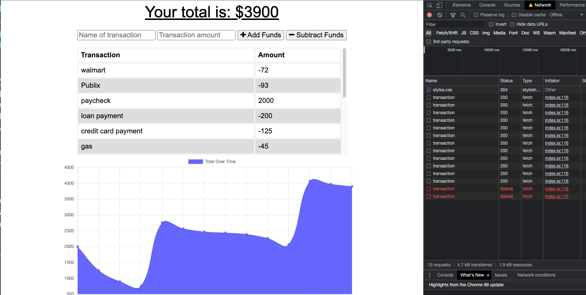
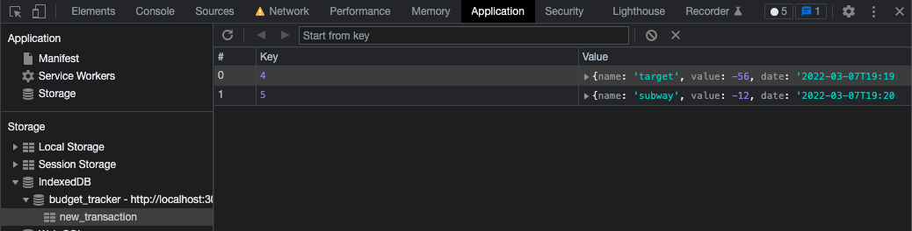
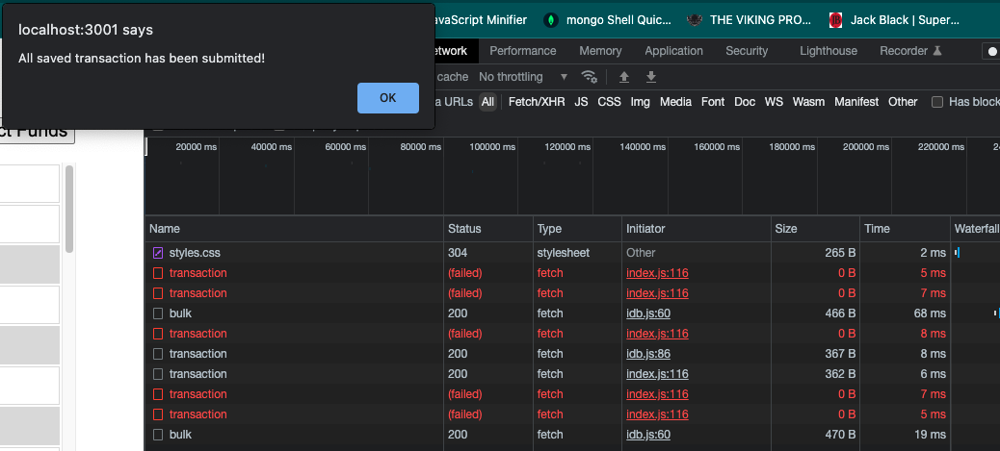

# Budget-Tracker-PWA

## Purpose

To create a fast and easy way to track your money with or without an internet connection.

## Table of Contents

* [Installation](#Installation)
* [Usage](#Usage)
* [Contributions](#Contributions)

## Installation

No installations are required. Just go to the deployed application:

## Usage

Budget Example:

Last two transactions red due to no internet connection

Message alerting user that the transaction was added to indexed db 
.png)

Indexed DB with two transactions added while offline

Success message after internet connection is reestablished

  
## Contributions

By: Alex Betancourt

Also, you can find more of my work on github: https://github.com/ajbf92.
